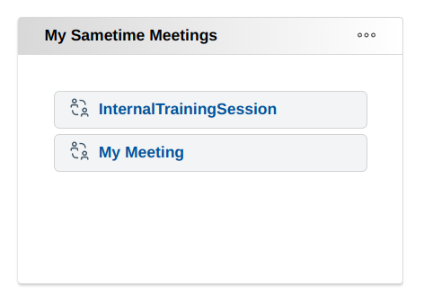
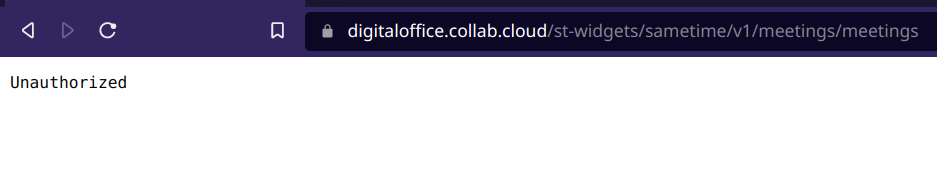
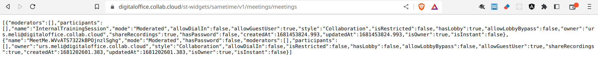
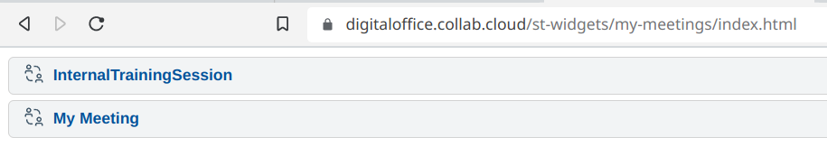
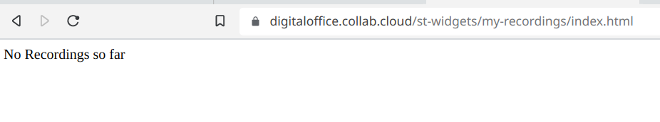

# Sample Sametime Widgets for Connections - Engage 2023

The following samples have been created for the [Engage 2023](https://engage.ug/Engage2.nsf/Pages/session2023) session 'AD02 - Your HCL Digital Office in the browser'

Just 2 small sample widgets, which shows your Sametime meetings and Recordings in Connections. The Widgets can be used in the Community Highlights or the Engagement Center.



It's a simple HTML widget

```html
<iframe src="https://digitaloffice.collab.cloud/st-widgets/my-meetings/index.html" style="border: 0px none; width: 100%; height: auto;">
</iframe>
```

In this small example we use the following servers:

- 'digitaloffice.collab.cloud' is the main Connections 8 Server.

- 'dosam.collab.cloud' is the Sametime 12 Server

SSO is already configured between both servers.

## Requirements

You need a working node.js/npm environment to build the angular widgets and docker with the compose plugin for the API proxy.

## Architecture

The widget has 2 components:

- An angular client
- API Proxy

### Angular Client

Configuration is stored in [app-config.ts](my-sametime-meetings/src/app/config/app-config.ts).
You need to replace the value for sametime with your Sametime-FQDN.
To build the client either run the [01.build-widgets.sh](01.build-widgets.sh) script. Then copy the SametimeWidgets*.zip file to you HTTP/IHS servers htdocs/st-widgets folder.

Or you could go into the my-sametime-meetings and my-sametime-recordings folder and run a manual build

```sh
npm install
npm run build:prod
```

then copy the folders  my-sametime-meetings/dist/my-meetings and my-sametime-recordings/dist/my-recordings to the htdocs/st-widgets folder on your IHS/HTTP server.

### API Proxy

The API Proxy is required if you like to avoid issues with CORS.
You need to adjust the set the value for SAMETIME_HOST in the [docker-compose](widget-proxy/docker-compose.yml)
For this test environment we run the API Proxy container on the Sametime docker instance.
Copy the widget-proxy folder to your docker server and run this from the widget-proxy folder:

```sh
docker compose build
docker compose up -d
```

The [st-widget.conf](st-widget.conf) needs to be included in your httpd.conf. dosam.collab.cloud should be replaced with the ip or fqdn where the API proxy container is running.

## Testing

Once the API Proxy container is up and the IHS has been restarted. The widget can be tested.
The widget proxy [https://digitaloffice.collab.cloud/st-widgets/sametime/v1/meetings/meetings]

If you're not logged into connections you'll get an unauthorized message.


Once you're logged in, you'll get the JSON back.


and the widget itself can be opened directly


If you don't have any recorded meetings it will show this:


## Possible improvements

Of course the Angular components could also be deployed as a docker container.
Just for the sake of simplicity I decided to put them into the htdocs folder.
And it might be usefull to add pagination to the widget.

## Disclaimer

THE SOFTWARE IS PROVIDED “AS IS”, WITHOUT WARRANTY OF ANY KIND, EXPRESS OR IMPLIED, INCLUDING BUT NOT LIMITED TO THE WARRANTIES OF MERCHANTABILITY, FITNESS FOR A PARTICULAR PURPOSE AND NONINFRINGEMENT. IN NO EVENT SHALL THE AUTHORS OR COPYRIGHT HOLDERS BE LIABLE FOR ANY CLAIM, DAMAGES OR OTHER LIABILITY, WHETHER IN AN ACTION OF CONTRACT, TORT OR OTHERWISE, ARISING FROM, OUT OF OR IN CONNECTION WITH THE SOFTWARE OR THE USE OR OTHER DEALINGS IN THE SOFTWARE.
